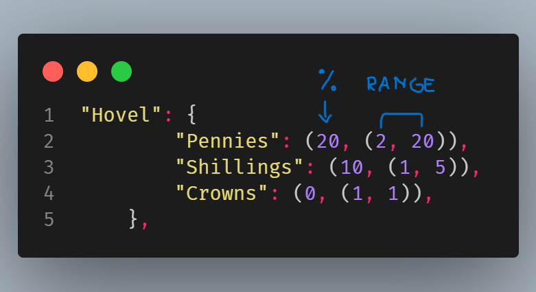
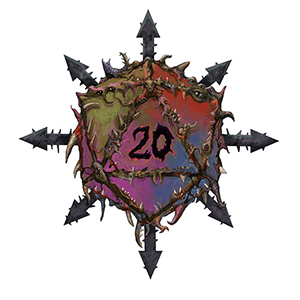

# Warhammer Fantasy RPG Loot Generator (4th Edition)

Welcome to the Warhammer Fantasy RPG Loot Generator! This tool is based on Skyperbole's exceptional unofficial work, "Treasure & Artefacts". Designed for Game Masters (GMs) who want to streamline their game and keep things interesting, this loot generator provides a randomized loot drop system for your RPG sessions.

## About The Project

This project was born from the constant requests for loot from my players after defeating various mobs. I decided to automate the loot system using Skyperbole's homebrew as the foundation.

Notably, this generator is geared towards low fantasy games and thus does not include magical items. Also, the loot is scarce by design; we don't want players bathing in gold after every encounter!

You can access the original "Treasure & Artefacts 1.0" here:
[Treasure & Artefacts 1.0](https://cdn.discordapp.com/attachments/449846068356710412/624839822472642580/WFRP4_-_Unofficial_Treasure__Artefacts_1.0.pdf)

## Customization

f you want to tweak the loot probability to fit your game's style, you can head to data > data_tables.py. Here, you can modify the values in building_loot_table and mob_loot_table.

The first value in these tables represents the percentage chance of an item being found, while the subsequent two numbers determine the quantity range of the drop. Adjust these parameters to create a loot distribution that fits your campaign!

I hope you find this tool useful and enjoyable for your games. If you have any feedback or suggestions, feel free to open an issue or submit a pull request.

Happy gaming!

### TODO

-   Add loot from Chest or secured places
-   Make the script has a main file that execute depending on what loot the gm wants to generate
